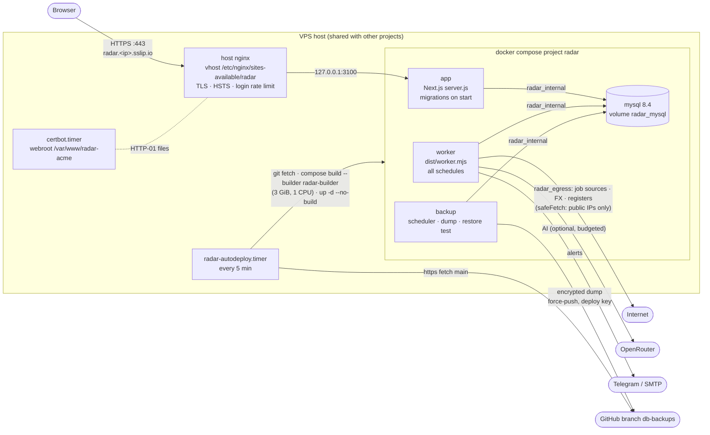
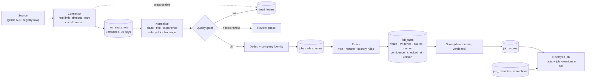
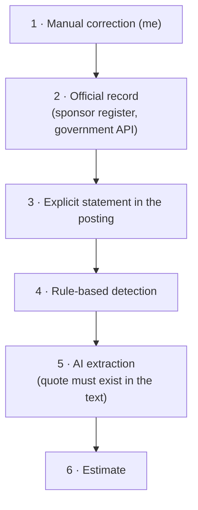
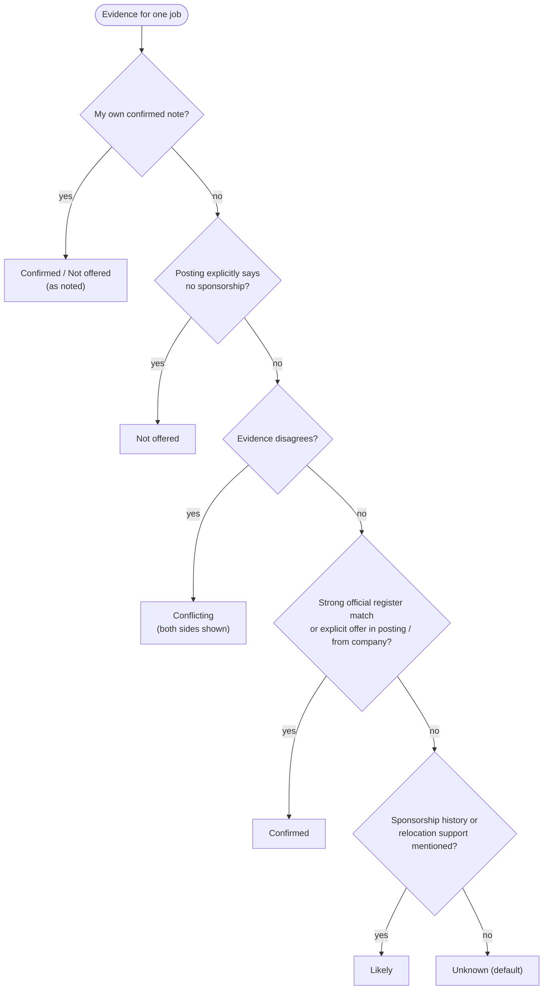

# RADAR — Architecture

RADAR is a single-user, login-walled job-hunting engine: it collects jobs daily from 40+
countries plus remote boards, normalises them, attaches **provenance to every fact**, decides visa
sponsorship conservatively, scores fit, and tracks applications. The product rules are in
[SPEC.md](SPEC.md), the build contracts in [BUILD_BRIEF.md](BUILD_BRIEF.md), operations in
[DEPLOY.md](DEPLOY.md) and [RECOVERY.md](RECOVERY.md).

Stack: Next.js 16 (App Router, standalone server) · React 19 · TypeScript (strict) · MySQL 8.4 ·
Drizzle ORM · zod · croner (worker schedules) · esbuild (worker bundle) · Docker Compose ·
host nginx + Let's Encrypt.

## 1. Runtime: containers and trust boundaries



- Only `app` is published, and only on `127.0.0.1:3100`; nginx is the single public entry.
  MySQL lives on `radar_internal` (a Docker network with no route out) and has no host port.
- Everything except `/login`, `/api/auth/login`, `/api/health` and static assets requires the
  session cookie (`src/proxy.ts` fast path + `requireSession()` against the `sessions` table).
- All posting HTML is untrusted: sanitised (`src/lib/security/sanitize.ts`) before display;
  every data-driven server-side fetch goes through `safeFetch()` (SSRF guard).
- Every database connection runs at `READ COMMITTED` (`src/lib/db/index.ts`): the default
  `REPEATABLE READ` deadlocked concurrent writers on gap locks (DECISIONS.md #5).
- Secrets live in `/opt/radar/.env` only. The app/worker never see the MySQL root password or the
  backup passphrase; the backup container never sees the session secret or AI key.

## 2. Data flow: raw in, clean out (spec §6)

Each stage stores its output, so any stage can be re-run from the previous one; a rule change
re-processes saved raw data instead of re-scraping.



Every run is recorded (`pipeline_runs`, `source_runs`); a source that failed or returned far
fewer jobs than normal never closes its jobs.

## 3. Trust order (spec §5)

A lower level can never overwrite a higher one; an AI result can never beat an official record.



Implementation: `src/lib/provenance/resolve.ts` picks the winning fact; `store.ts` persists
facts with their provenance.

## 4. Visa decision (spec §13.4)



AI signals can support *Likely* or *Conflicting* but never produce *Confirmed*. Weak register
matches show as "Possible match — verify". The "Am I eligible?" check compares my facts with the
country rule version valid today and answers Meets · Borderline · Doesn't meet · Can't tell, with
the rule's verified date. Code: `src/lib/visa/` (`signals.ts`, `decide.ts`, `eligibility.ts`).

Company evidence comes from the nightly register match (03:00 UTC): the five registers
(`src/lib/registers/`: UK, NL, DK licensed sponsors; IE, CA sponsorship history) are imported and
every company is matched against them (`refreshRegistersAndEvidence` in `src/lib/visa/company-evidence.ts`);
a company whose evidence changed has its jobs' visa verdicts re-evaluated. Only a strong match to a
licensed-sponsor entry *in the job's own country* can make a job *Confirmed*; a fuzzy match or a
sponsor in another country gives *Likely · low*.

## 5. Module map

| Area | Code | Owns |
|---|---|---|
| Environment | `src/lib/env.ts` | the only reader of `process.env` (zod, lazy) — health's `GIT_SHA` is the one documented exception |
| Database | `src/db/schema/*.ts`, `drizzle/`, `src/lib/db/`, `src/db/migrate.ts` | Drizzle schema, generated SQL migrations, pool, migrator |
| Auth + security | `src/proxy.ts`, `src/lib/auth/`, `src/app/api/auth/`, `src/lib/security/` | session JWT + DB check, login lockout, sanitising, SSRF-safe fetch |
| Provenance + audit | `src/lib/provenance/`, `src/lib/audit.ts` | facts with evidence; audit trail |
| Contracts | `src/lib/contracts/` | shared TypeScript interfaces between areas |
| Pipeline | `src/lib/pipeline/`, `src/lib/connectors/`, `src/lib/http/`, `src/lib/lifecycle/`, `src/lib/linkcheck/`, `src/lib/alerts/`, `src/worker/` | connectors, runs, lifecycle, link health, alerts, schedules |
| Normalise | `src/lib/normalize/`, `src/lib/dedup/`, `src/lib/company/`, `src/lib/fx/`, `src/data/{places,titles,salary}/` | place/title/salary/experience/language, dedup, company identity, FX |
| Visa · remote · scoring | `src/lib/visa/`, `src/lib/remote/`, `src/lib/scoring/`, `src/lib/registers/`, `src/data/{visa,remote}/` | country rules, register import, visa decision, remote classes, Fit Score |
| AI + accuracy | `src/lib/ai/`, `src/lib/accuracy/` | budgeted OpenRouter calls with quote verification; golden sample + evaluation |
| Seed data | `src/db/seed/`, `src/data/seed/`, `scripts/seed.ts` | countries, rules, sources, companies |
| UI | `src/app/(app)/**`, `src/components/**`, `src/lib/queries/*`, `src/lib/actions/*` | pages, server actions (each starts with `requireSession()`) |
| Tracker | `src/lib/tracker/`, `src/app/(app)/applications/**`, `src/app/api/export/` | append-only timeline, apply-time snapshots, export |
| Health | `src/app/api/health/` | `{ ok, db }` through nginx (X-Real-IP set); `{ ok, db, lastRunAgeHours, version }` only for loopback probes; 2 s DB timeout, no secrets |
| Infra | `Dockerfile`, `docker-compose.yml`, `scripts/build-worker.mjs`, `ops/**`, `.github/workflows/ci.yml` | images, compose, bundles, install/deploy/backup, CI |

`ops/` in detail:

| Path | Purpose |
|---|---|
| `ops/install.sh` | idempotent VPS installer (clone/pull → .env → deploy key → nginx + cert → compose → seed/restore → timer) |
| `ops/deploy.sh`, `ops/autodeploy.sh` | manual / timer deploy with health check and rollback |
| `ops/secrets.sh` | encrypt/decrypt/check `.env` ↔ `ops/secrets.env.enc`; `init` a new `.env` |
| `ops/lib/common.sh` | shared shell helpers (env file editing, nginx rendering, compose, deploy + rollback) |
| `ops/nginx/*.conf.template` | the RADAR vhost and its certificate bootstrap variant |
| `ops/systemd/radar-autodeploy.{service,timer}` | 5-minute auto-deploy |
| `ops/docker/entrypoint.sh`, `wait-for-migrations.ts` | app-image roles (web, worker, cli, seed, eval, migrate, hash-password) |
| `ops/backup/` | backup image: `scheduler.sh`, `backup.sh`, `restore.sh`, `restore-test.sh`, `radar-alert.sh`, pinned `github_known_hosts` |

Bundles (`npm run build:worker`, esbuild, Node 22 ESM) in `dist/`: `worker.mjs`
(`src/worker/index.ts`), `cli.mjs` (`src/worker/cli.ts`), `migrate.mjs` (`src/db/migrate.ts`),
`seed.mjs` (`scripts/seed.ts`), `eval.mjs` (`src/lib/accuracy/cli.ts`),
`wait-for-migrations.mjs`, `hash-password.mjs`.

## 6. Schedules

```mermaid
gantt
    title One UTC day (IST = UTC + 5:30)
    dateFormat HH:mm
    axisFormat %H:%M
    section Host
    auto-deploy check every 5 min      :active, 00:00, 24h
    section backup container
    daily encrypted backup 21:00       :crit, 21:00, 30m
    monthly restore test, day 1, 22:00 :22:00, 30m
    section worker
    pipeline, link checks, FX, registers, heartbeat, digest, AI queue, retention (src/worker) :00:00, 24h
```



| Job | When (UTC) | Failure handling |
|---|---|---|
| Auto-deploy | every 5 min | rollback to the previous commit + critical `deploy_failed` alert; max 3 attempts per commit |
| Backup | daily 21:00 | one retry after 1 h; critical `backup_failed` alert (deduped per day); missed runs caught up 10 min after a restart |
| Restore test | day 1 of the month, 22:00 | one retry; critical `restore_test_failed` alert; fails if the newest backup is > 72 h old |
| Certificate renewal | twice daily (`certbot.timer`) | certbot logs; deploy hook `nginx -t && systemctl reload nginx` |
| Worker jobs | the table in [OPERATIONS.md §2](OPERATIONS.md) (`src/worker/index.ts`, croner) | per-source isolation, run reports, heartbeat alert when a run is missing |
| After a run | review-queue housekeeping (`src/lib/dedup/tidy.ts`, `src/lib/normalize/title-tidy.ts`) | never throws; a failure is logged and the run result is unaffected |

## 7. Backups

```mermaid
sequenceDiagram
    participant S as scheduler (backup)
    participant M as mysql
    participant G as GitHub db-backups
    S->>M: row counts (before)
    S->>M: mysqldump --single-transaction
    Note over S: gzip -9 · openssl aes-256-cbc pbkdf2 600k · sha256
    S->>M: row counts (after) → volatile tables
    S->>S: decrypt + gunzip self-check, "Dump completed" marker
    S->>G: ls-remote + LATEST.json/LATEST.meta.enc of the stored copy (shrink guard; unreadable = refuse)
    S->>G: force-push ONE orphan commit (dump + plain LATEST.json + encrypted LATEST.meta.enc)
    S->>G: ls-remote: remote head == pushed commit
    S->>M: backup_runs row (ok / failed) · alert on failure
```

The branch never accumulates history (one commit, replaced nightly), stays under GitHub's file
limit (45 MiB parts), and is useless without `BACKUP_PASSPHRASE`.
